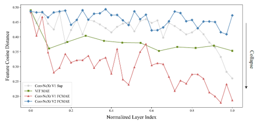
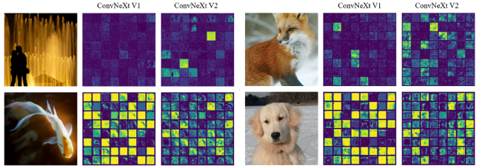
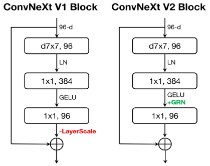
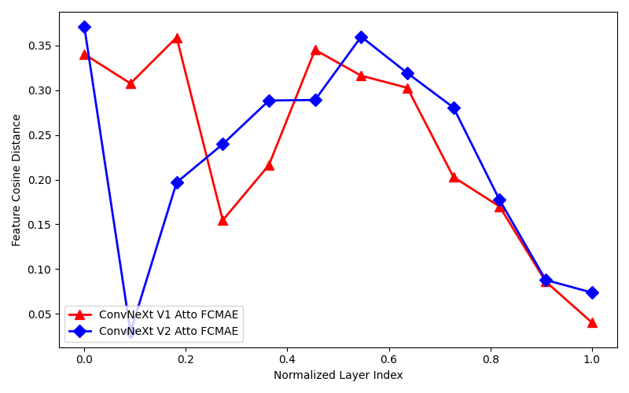
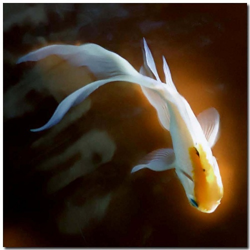
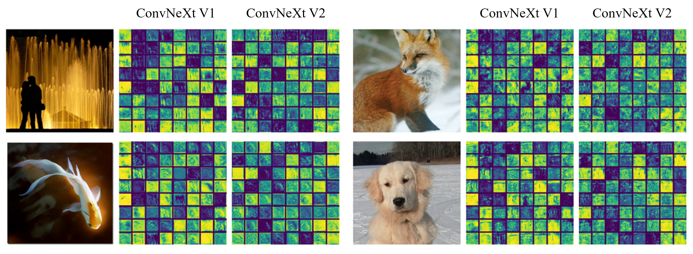

# [Reproduction] ConvNeXt V2: Co-designing and Scaling ConvNets with Masked Autoencoders

> [!NOTE]
> This project focuses on reproducing some key findings of [**ConvNeXt V2: Co-designing and Scaling ConvNets with Masked Autoencoders (Woo et al., 2023)**](https://openaccess.thecvf.com/content/CVPR2023/html/Woo_ConvNeXt_V2_Co-Designing_and_Scaling_ConvNets_With_Masked_Autoencoders_CVPR_2023_paper.html)  
> The official code release is available [here](https://github.com/facebookresearch/ConvNeXt-V2)

## 1. Introduction
The primary objective of this project is to investigate the feature collapse issue observed when pre-training pure ConvNets with MAE (masked autoencoder), specifically testing the scalability of these findings on smaller architectures.  

**Original Findings** The original study demonstrates this phenomenon through quantitative metrics and qualitative visualization. As shown in **Figure 1**, the original authors observed that **ConvNeXt V1** suffers from a significant drop in feature diversity (red line) during pre-training, whereas **ConvNeXt V2** with GRN maintains high diversity (blue line).  

<p align='center'>
    
    <br>
    Figure 1. Feature Cosine Distance (Woo et al., 2023)
</p>

Qualitatively, this 'collapse' manifests as redundant or 'dead' feature maps in V1, contrasting with the diverse and active feature maps in V2, as illustrated in **Figure 2**.

<p align='center'>
    
    <br>
    Figure 2. Feature Activation Visualization (Woo et al., 2023)
</p>

**Our Objectives** Based on these findings, we aim to:  
1. **Reproduce feature collapse**: Confirm that [ConvNeXt V1 (Liu et al., 2022)](https://openaccess.thecvf.com/content/CVPR2022/html/Liu_A_ConvNet_for_the_2020s_CVPR_2022_paper.html) suffers from feature collapse during FCMAE (fully convolutional masked autoencoder) pre-training, verifying whether this structural phenomenon persists even in the lightweight Atto (3.7M) model.  
2. **Verify GRN efficacy**: Validate that the GRN (global response normalization) layer introduced in ConvNeXt V2 effectively mitigates this collapse and improves feature diversity, consistent with findings in the larger Base (89M) model.

## 2. Experimental Setup
We reconstructed the experimental environment by closely following the details provided in the **Appendix** of the original paper, adapting the batch size and model scale to fit available resources.

### 2-1. Model Configuration
|Model|Configuration|#Parameters|
|:---|:---|:---|
|**ConvNeXt V1-Atto**|depths=[2, 2, 6, 2], <br>dims=[40, 80, 160, 320]|3.7M|
|**ConvNeXt V2-Atto**|depths=[2, 2, 6, 2], <br>dims=[40, 80, 160, 320]|3.7M|

### 2-2. Training Details
- **Datasets**: [ImageNet-1K](https://www.image-net.org/index.php)
- **#Epochs**: 800 (with 40 warmup epochs)
- **(Effective) Batch Size**: 4096 (`4 GPUs`$\times$`128 batch_size`$\times$`8 update_freq`)
- **Optimizer**: AdamW (lr=1.5e-4, weight_decay=0.05)
- **Mask Ratio**: 0.6

## 3. Implementation Details
### 3-1. FCMAE Framework (Dense Masking)
While the original authors utilized the **Minkowski Engine** to implement sparse convolutions for efficiency, we implemented a **Dense Masking** strategy for this reproduction. This approach applies a binary mask to the dense tensors, which are theoretically equivalent in terms of learning signals, though computationally distinct.

### 3-2. Analysis Strategy
To quantify feature collapse, we measured the **Feature Cosine Distance**. We utilized PyTorch [`register_forward_hook`](https://docs.pytorch.org/docs/stable/generated/torch.nn.Module.html#torch.nn.Module.register_forward_hook) to extract feature maps from specific layers during inference. The extraction points differ slightly between V1 and V2 to capture the effect of the GRN layer as shown in **Figure 3**:

<p align='center'>
    
    <br>
    Figure 3. ConvNeXt V1 and V2 Block Design (Woo et al., 2023)
</p>

- **ConvNeXt V1**: After the **GELU layer** in the expansion MLP
- **ConvNeXt V2**: After the **GRN layer** in the expansion MLP

The average cosine distance between each channel across the spatial dimensions was computed to measure feature diversity:
$$\text{Feature Cosine Distance}=\displaystyle\frac{1}{C}\sum_i^C\sum_j^C\frac{1-\text{cos}(X_i, X_j)}{2}$$

## 4. Reproduction Results
### 4-1. Quantitative Analysis: Feature Cosine Distance

<p align='center'>
    
    <br>
    Figure 4. Reproduced Feature Cosine Distance
</p>

**Observations**:
1. **Global Trend**: ConvNeXt V1 pre-trained with FCMAE exhibited a significant drop in feature cosine distance across layers, confirming the occurrence of **Feature Collapse** even at the Atto scale.  
2. **Effect of GRN**: ConvNeXt V2 maintained relatively high feature cosine distance values in most layers, demonstrating that the GRN layer successfully encourages feature competition and diversity.  
3. **Final Layer Collapse**: Notably, unlike the Base model results in the paper, our reproduction on the Atto model shows that **Feature Collapse re-occurs significantly in the final layer** for ConvNeXt V2.

### 4-2. Qualitative Analysis: Feature Activation Visualization
To qualitatively assess feature diversity, we targeted the **specific layer that exhibited the largest discrepancy** in Feature Cosine Distance between V1 and V2. From this layer, we **randomly sampled 64 channels**.  

The visualization results were generated using the following sample images from the ImageNet-1K validation set. Details of these samples are listed below.

|Subject|Image|Class|Original Name|  
|:---:|:---:|:---:|:---:|  
|Fountain||562|37420.jpg|  
|Goldfish||1|28049.jpg|  
|Fox||277|20456.jpg|  
|Dog||207|9135.jpg|

<p align='center'>
    
    <br>
    Figure 5: Reproduced Feature Activation Visualization
</p>

**Observations**:
- **Visual Distinction**: While the quantitative difference is pronounced, the visual difference is relatively subtle; however, V1 clearly exhibits more "dead channels" (monotonous patterns) compared to V2.

### 4-3. Limitations
- **Model Capacity Bottleneck**: Contrary to the Base model reported in the original paper, the Atto model exhibited a sharp drop in feature distance at the final layer. This suggests that while GRN works, the limited capacity of the Atto model creates an information bottleneck at the deepest stage.
- **Training Efficiency**: We observed an approximate **33% increase in training time** (9 min/epoch $\rightarrow$ 12 min/epoch) with GRN enabled. While GRN adds negligible parameters, the operation introduces a computational overhead that affects wall-clock time.

## 5. Usage
If you want to reproduce our results, please clone this repository first. You can either train the model from scratch using the commands below or use our pre-trained checkpoints (located in `./ckpt/`) to skip training and proceed directly to evaluation.
```bash
git clone https://github.com/inextro/advanced-deep-learning.git
cd advanced-deep-learning
```

### 5-1. Pre-training
We use `torchrun` to enable distributed training on a single node with 4 GPUs. The effective batch size is set to 4096 (`4 GPUs`$\times$`128 batch_size`$\times$`8 update_freq`)
```bash
CUDA_VISIBLE_DEVICES=0,1,2,3 nohup python3 -m torch.distributed.run --nproc_per_node=4 main_pretrain.py --model fcmae_convnext_v1_atto --batch_size 128 --update_freq 8 --blr 1.5e-4
```
>[!Tip]
> Change `--model` to `fcmae_convnext_v2_atto` to train the V2 model.

### 5-2. Evaluation and Visualization
To reproduce the figures and plots presented in this report, you can run the following analysis scripts. These scripts require the pre-trained checkpoints (e.g., `convnext_v1_atto_799.pth`) to be present in the `./ckpt` directory.

**Generate Feature Cosine Distance Plot**
```bash
python3 main_cosine_distance.py
```

**Generate Feature Activation Visualization**
```bash
python3 main_viz_example.py
```
The results will be saved in `./assets/results/`

## References
- Liu, Z., Mao, H., Wu, C.-Y., Feichtenhofer, C., Darrell, T., & Xie, S. (2022). A ConvNet for the 2020s. 11976–11986. https://doi.org/10.1109/CVPR52688.2022.01167
- Woo, S., Debnath, S., Hu, R., Chen, X., Liu, Z., Kweon, I. S., & Xie, S. (2023). ConvNeXt V2: Co-Designing and Scaling ConvNets With Masked Autoencoders. 16133–16142. https://doi.org/10.48550/arXiv.2301.00808